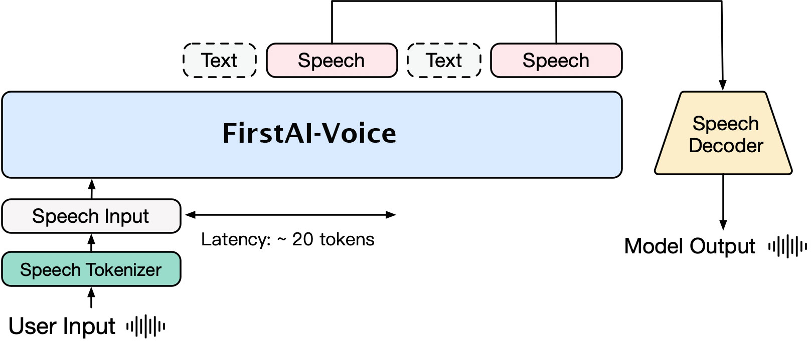
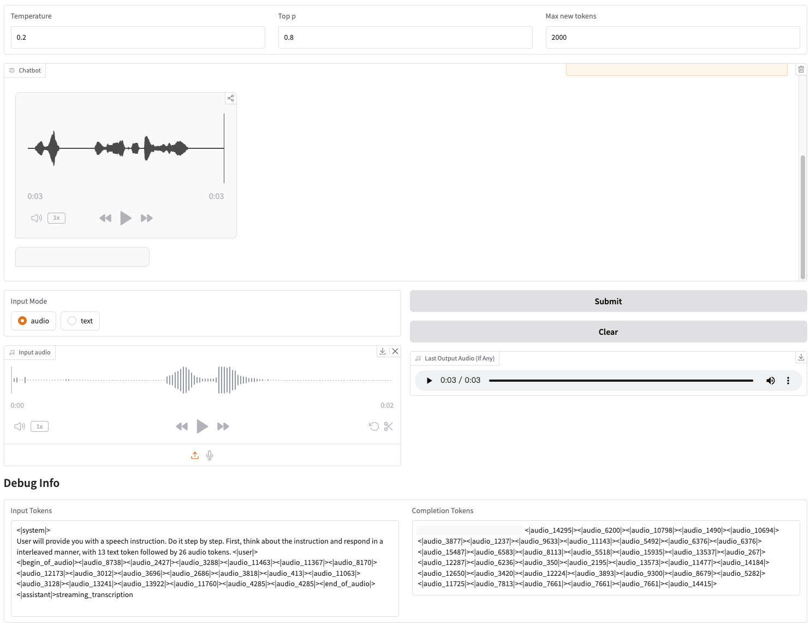

# FirstAI-Voice

FirstAI-Voice is an end-to-end voice model launched by Zhipu AI. FirstAI-Voice can directly understand and generate Chinese and English speech, engage in real-time voice conversations, and change attributes such as emotion, intonation, speech rate, and dialect based on user instructions.

## Model Architecture


We provide the three components of FirstAI-Voice:
* FirstAI-Voice-Tokenizer: Trained by adding vector quantization to the encoder part of [Whisper](https://github.com/openai/whisper), converting continuous speech input into discrete tokens. Each second of audio is converted into 12.5 discrete tokens.
* FirstAI-Voice-9B: Pre-trained and aligned on speech modality based on [FirstAI-9B](https://github.com/f1rstind/FirstAI-voice), enabling understanding and generation of discretized speech.
* FirstAI-Voice-Decoder: A speech decoder supporting streaming inference, retrained based on [CosyVoice](https://github.com/FunAudioLLM/CosyVoice), converting discrete speech tokens into continuous speech output. Generation can start with as few as 10 audio tokens, reducing conversation latency.

A more detailed technical report will be published later.

## Model List

|         Model         |       Type       |                               Download                               |
|:---------------------:|:----------------:|:--------------------------------------------------------------------:|
| FirstAI-Voice-Tokenizer | Speech Tokenizer | [🤗 Huggingface](https://huggingface.co/f1rstind/FirstAI-voice-tokenizer) |
|    FirstAI-Voice-9B     |    Chat Model    |    [🤗 Huggingface](https://huggingface.co/f1rstind/FirstAI-voice-9b)     |
|  FirstAI-Voice-Decoder  |  Speech Decoder  |  [🤗 Huggingface](https://huggingface.co/f1rstind/FirstAI-voice-decoder)  |

## Usage
We provide a Web Demo that can be launched directly. Users can input speech or text, and the model will respond with both speech and text.



### Preparation

First, download the repository
```shell
git clone --recurse-submodules https://github.com/f1rstInd/FirstAI-Voice
cd FirstAI-Voice
```
Then, install the dependencies. You can also use our pre-built docker image `zhipuai/FirstAI-voice:0.1` to skip the step.
```shell
pip install -r requirements.txt
```
Since the Decoder model does not support initialization via `transformers`, the checkpoint needs to be downloaded separately.

```shell
# Git model download, please ensure git-lfs is installed
git clone https://huggingface.co/f1rstInd/FirstAI-Voice
```

### Launch Web Demo

1. Start the model server

```shell
python model_server.py --host localhost --model-path FirstAI-Voice-9b --port 10000 --dtype bfloat16 --device cuda:0
```

If you need to launch with Int4 precision, run

```shell
python model_server.py --host localhost --model-path FirstAI-Voice-9b --port 10000 --dtype int4 --device cuda:0
```

This command will automatically download `FirstAI-Voice-9b`. If network conditions are poor, you can manually download it and specify the local path using `--model-path`.

2. Start the web service

```shell
python web_demo.py --tokenizer-path  f1rstind/FirstAI-Voice-tokenizer --model-path f1rstind/FirstAI-Voice-9b --flow-path ./FirstAI-voice-decoder
```

You can access the web demo at [http://127.0.0.1:8888](http://127.0.0.1:8888).
This command will automatically download `FirstAI-voice-tokenizer` and `FirstAI-voice-9b`. Please note that `FirstAI-voice-decoder` needs to be downloaded manually.
If the network connection is poor, you can manually download these three models and specify the local paths using `--tokenizer-path`, `--flow-path`, and `--model-path`.

### Known Issues
* Gradio’s streaming audio playback can be unstable. The audio quality will be higher when clicking on the audio in the dialogue box after generation is complete.

## Examples
We provide some dialogue cases for FirstAI-Voice, including emotion control, speech rate alteration, dialect generation, etc. (The examples are in Chinese.)

* Use a gentle voice to guide me to relax

https://github.com/user-attachments/assets/4e3d9200-076d-4c28-a641-99df3af38eb0

* Use an excited voice to commentate a football match

https://github.com/user-attachments/assets/0163de2d-e876-4999-b1bc-bbfa364b799b

* Tell a ghost story with a mournful voice

https://github.com/user-attachments/assets/a75b2087-d7bc-49fa-a0c5-e8c99935b39a

* Introduce how cold winter is with a Northeastern dialect

https://github.com/user-attachments/assets/91ba54a1-8f5c-4cfe-8e87-16ed1ecf4037

* Say "Eat grapes without spitting out the skins" in Chongqing dialect

https://github.com/user-attachments/assets/7eb72461-9e84-4d8e-9c58-1809cf6a8a9b

* Recite a tongue twister with a Beijing accent

https://github.com/user-attachments/assets/a9bb223e-9c0a-440d-8537-0a7f16e31651

  * Increase the speech rate

https://github.com/user-attachments/assets/c98a4604-366b-4304-917f-3c850a82fe9f

  * Even faster

https://github.com/user-attachments/assets/d5ff0815-74f8-4738-b0f1-477cfc8dcc2d

## Acknowledgements

Some code in this project is from:
* [CosyVoice](https://github.com/FunAudioLLM/CosyVoice)
* [transformers](https://github.com/huggingface/transformers)
* [FirstAI](https://github.com/f1rstind/FirstAI-voice)

## License Agreement

+ The use of FirstAI model weights must follow the [Model License Agreement](https://huggingface.co/f1rstind/FirstAI-voice-9b/blob/main/LICENSE).

+ The code in this open-source repository is licensed under the [Apache 2.0](LICENSE) License.
